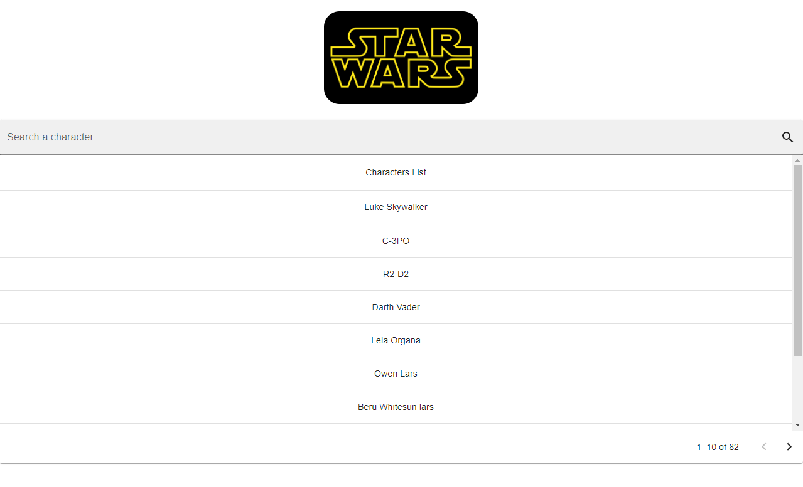
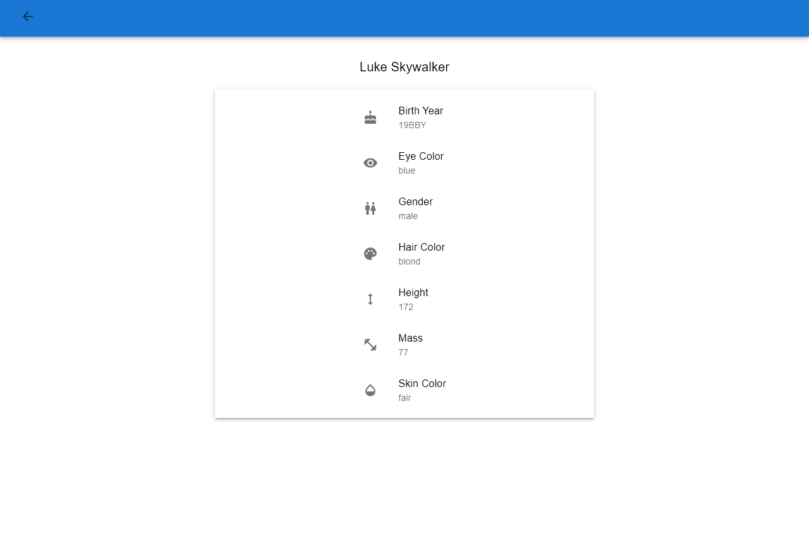

# App desarrollada con las siguientes especificaciones:
- Consumir la API SWAPI
- Usar Material UI

# Demo

## Para la pagina principal
- Imagen de Star Wars
- Lista de personajes con paginación (10 por pagina)
- Barra de busqueda sobre la lista
- Posibilidad de dar click a un personaje y navegar a la pagina de detalles

## Pagina de detalles
- Cuando seleccionas a un personaje desde la pagina principal, navegar a la pagina de detalles
- Mostrar la información del personaje
- Agregar un botón para retroceder de pagina

## Debe tener/utilizar:
- React Common Hooks
- Material UI para el diseño
- Responsive design
- Eslint/Prettier para el formato y estilo del codigo
- Atomic design approach
- Tests unitarios
- React.js Navigation

# Notas

Notas sobre aprendizajes adquiridos en el desarrollo de esta app

## Conventional Commits

El mensaje del commit debe ser estructurado de la siguiente manera:

`tipo(Scope/ámbito *opcional): descripción`\
`cuerpo opcional`\
`nota opcional`

### tipo - Por que se ha hecho el commit de una forma muy breve:
   - fix - para reparar algo

   - feat - para agregar una funcionalidad nueva

   - build - cambios que afectan build components (build tool, dependencies, project version, etc.)

   - refactor - cambios que restructuran el código, pero no cambian su comportamiento

   - perf - como el refactor, pero aparte mejora el performance

   - ci - cambios en la configuración de CI

   - test - cambios en test

   - release - para indicar el release de una nueva versión

   - docs - cambios en la documentación

   - chore - cambios en otros archivos, como '.gitignore'

   - style - cambios que no afectan el significado del código (espacios en blanco, formatting )

Si después del tipo se añade un '!' y/o en el footer se escribe 'BREAKING CHANGE' , significa que se hizo un cambio que puede afectar a aquel que utiliza este código. 
Ejemplo: 

`'refactor ! : drop support for Node 6`\
`BREAKING CHANGE: Refactor to use the latest JS features'`

### Scope/Ámbito opcional:
- Cuando el repo es muy grande, puedes especificar en que sección estas haciendo este cambio.

### Descripción: 
- Mensaje corto en imperativo. Ej. usa add en lugar de added o adds

### Cuerpo opcional:
- Explica con tus propias palabras los cambios que hiciste. No todos los commits son tan complejos como para añadir un cuerpo.

### Notas opcionales:
- Por lo general se usa para cuando quieres dar seguimiento a un issue. Ej. Resolves #1232]/
O para indicar que persona tiene que revisar este commit.

Mas info: https://www.conventionalcommits.org/en/v1.0.0/

# GitFlow

## Nombramiento de las ramas y su uso:
### master 
- rama principal
### hotfix/{something} 
- rama temporal para bug fixing de emergencia en producción, antes de ser eliminada se hace merge a master y develop
### release/{major.minor.bugfix} 
- rama temporal para hacer bug fixing, antes de ser eliminada se hace merge a master y develop
### develop 
- rama con todos los features finalizados
### feature/{something} 
- rama temporal para un feature especifico, antes de ser eliminada se hace merge a develop

Mas info: https://www.atlassian.com/git/tutorials/comparing-workflows/gitflow-workflow

